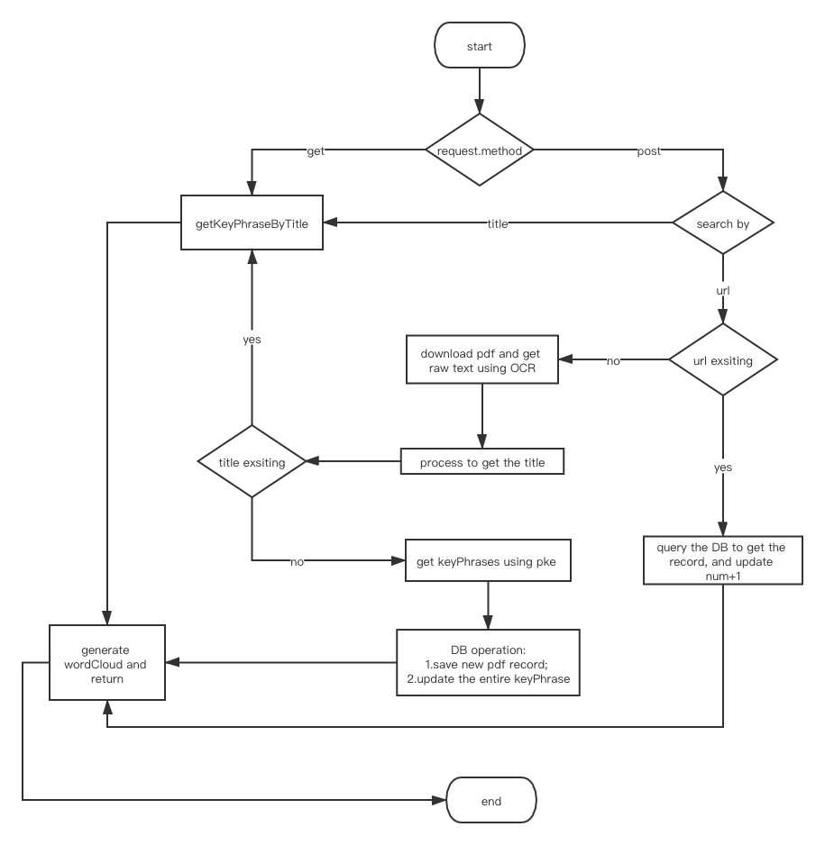

# KeyPhrase Visualization
### Description
**For WING's task one**   
#### Input :  
- URL for PDF
#### Requirements:   
- Fetch the PDF using the input URL
- Identify the content and title of the PDF using OCR processor
- Get keyPhrases of the content and store it with the title and URL locally
- Visualize top keyPhrases for the entire digested collection
- Visualize keyPhrases for a particular paper

### File Structure  
keyphrase  
├── app01  
│   ├── __init__.py  
│   │   ├── __init__.cpython-37.pyc  
│   │   ├── admin.cpython-37.pyc  
│   │   ├── models.cpython-37.pyc  
│   │   ├── views.cpython-37.pyc  
│   │   └── worker.cpython-37.pyc  
│   ├── admin.py  
│   ├── apps.py  
│   ├── migrations  <small>*(Migration for DataBase )*</small>  
│   │   ├── 0001_initial.py  
│   │   └── __init__.py  
│   │       ├── 0001_initial.cpython-37.pyc  
│   │       └── __init__.cpython-37.pyc  
│   ├── models.py  
│   ├── static  <small>*(css and image file to be load into html)*</small>  
│   │   ├── css  
│   │   │   ├── detail.css  
│   │   │   ├── index.css  
│   │   │   └── search.css  
│   │   └── image  
│   │       └── bg.jpg  
│   ├── templates   <small>*(html templates)*</small>  
│   │   ├── detail.html  
│   │   ├── index.html  
│   │   ├── keyPhraseList.html  
│   │   ├── pdfList.html  
│   │   └── searchPage.html  
│   ├── tests    <small>*(uni-test)*</small>  
│   │   ├── __init__.py  
│   │   │   ├── __init__.cpython-37.pyc  
│   │   │   └── tests.cpython-37.pyc  
│   │   └── tests.py  
│   ├── views.py    <small>*(receive the request and return views)*</small>  
│   └── worker.py   <small>*(core code of operation)*</small>  
├── db.sqlite3  
├── docs    <small>*(docs)*</small>  
│   ├── detail.jpg  
│   ├── flowchartOfSearch.png  
│   ├── framework.png  
│   ├── index.jpg  
│   ├── keyPhraseList.jpg  
│   ├── pdfList.jpg  
│   ├── search.jpg  
│   └── wordCloudOfAll.jpg  
├── keyphrase  
│   ├── __init__.py  
│   │   ├── __init__.cpython-37.pyc  
│   │   ├── settings.cpython-37.pyc  
│   │   ├── urls.cpython-37.pyc  
│   │   └── wsgi.cpython-37.pyc  
│   ├── asgi.py  
│   ├── settings.py  <small>*(config document)*</small>  
│   ├── urls.py     <small>*(routes URLs to views)*</small>  
│   └── wsgi.py  
├── log.log     <small>*(logs)*</small>  
├── manage.py  
├── readme.md   <small>*(Project description document)*</small>  
└── requirements.txt  <small>*(packages to be installed)*</small>  

### **Data Structure：**  (Corresponding to the tables)
**PDFContent**:    <small>*(the information of scholar Pdf files )*</small>  
-    **title**T = models.CharField(max_length=100, unique=True)    <small>*( title of the scholar Pdf, the Unique identifier in the database)*</small>   
-    **url** = models.CharField(max_length=200, default='')    <small>*(url of the scholar Pdf)*</small>  
-    **keyPhrase** = models.TextField(null=False)    <small>*( the descriptions of each module)*</small>  
-    **num** = models.IntegerField(default=1)    <small>*(how many times the paper has been searched  )*</small>  


**TotalKeyPhrases**:    <small>*(the keyPhrases in the entire digested collection)*</small>  
-    **content** = models.CharField(max_length=200, unique=True)    <small>*(the content of keyPhrase, the Unique identifier in the database)*</small>  
-    **frequency** = models.FloatField(default=0.0)    <small>*(the accumulated frequency of KeyPhrase)*</small>  
-    **titles** = models.TextField(null=False)    <small>*(titles of PDF which has this keyPhrase)*</small>  
         

### **Interfaces to DB:**  
**class PDFContent**    

        `def getByFields(self, field, content)`  
        `def getHotPDFList(self, limit)`  
    
  **class TotalKeyPhrases**    
        
        `def getAll(self)`  
        `def getPDFListByKeyPhrase(self, keyPhrase)`  
        `def updateNewPDF(self, keyPhrases, title)`  
        `def getHotKeyPhraseList(self, limit)`  
    
## How to use
### Install using pip
Install the required packages: 
 `pip install -r requirements.txt`
 
### Create the DB
Migrate sqlite3 DB according to the Django :  
```
python manage.py makemigrations
python manage.py migrate
```

### Start the server
Run the django project locally  
```
python manage.py runserver 
```

### Use the system on your browser
Visit http://127.0.0.1:8000/ to get started, or the port you config  


### Unit test  
Unit test store at **/app01/tests/**, Details by reading `tests.py`  
```
python manage.py runserver 
```

## System Framework  
The links between pages of the system is shown blow  
  


## Pages
### Index page
Click to choose the operation you want!  
  

### Search page
Type the content in the box, choose to search by title or url, if by title, only papers been searched before will do!  
  

### KeyPhraseList page
Show keyPhrases with the biggest frequency, and click to see related papers or the wordCloud of all the keyPhrases!  
  


### PdfList page
Show the Pdfs which are hot or related to a certain keyPhrase, and click to see the detail of the pdf!  
  


### Detail.page
Show the details of pdf!  
  

## Modules
### Search module
#### Overall


#### Process

##### Distribute request of search 
- Using`search(request)`to distribute request by request.method and search_type
- NOTE: Title must be in the DB, url must be directly access to the pdf
```python  
def search(request):
    """
    deal with search
    POST: from searchPage.html, two ways: title or url
    GET: from href inside list pages
    :param request:
    :return: detail.html
    """
    template = loader.get_template('detail.html')
    # search on the search page
    if request.method == "POST":
        # get the params
        search_type = request.POST.get('type').strip()
        input = request.POST.get('url_pdf').strip()
        # if search by url
        if search_type == 'URL':
            # check the validation
            result = getKeyPhraseByURL(input)
        # if search by title
        elif search_type == 'Title':
            result = getKeyPhraseByTitle(input)
        # check the result
        if not result.get('result'):
            messages.warning(request, 'Invalid Input! plz retry!    ' + result.get('message'))
            return render(request, 'searchPage.html')
        return HttpResponse(template.render(result, request))
    else:
        # search from href inside list pages
        input = request.GET.get("title");
        result = getKeyPhraseByTitle(input)
        # check the result
        if not result.get('result'):
            return HttpResponse(request, 'mission failed, plz retry')
        return HttpResponse(template.render(result, request))

```  

##### Search exsiting records in DB (by title OR the pdf can be find)
- Use `getByFields(self, field, content)` to see if exsits and get the keyPhrases from DB.

##### Search by new url
- Download the Pdf and use ocr function `pytesseract.image_to_string ` to get raw text
```python       
    web_file = urllib.request.urlopen(url)
    pages = pdf2image.convert_from_bytes(web_file.read())
    for page in pages:
        text = text + str(pytesseract.image_to_string(page))
```
- Use `processContent(text)` to get the title, assume the title is on the top
- Use model TopicRank `pke.unsupervised.TopicRank() ` to generate keyPhrases

##### KeyPhrases visualization
- Use `generateWoldCloud(keyPhrases)` to visualize KeyPhrases of the pdf


### PdfList module
#### Overall
- Displaying papers which are searched most frequently
- Get access to them
#### Process
- Use `keyPhraseList(request)` to get the hot papers --> `pdfList.html`
- Use the code
```html 
    <td><a href="/search?title={{ i.title }}">{{ i.title }}</a></td>
```
to invoke `search(request)` to view the detail of papers, and the method will be GET --> `detail.html`

### KeyPhraseList module
#### Overall
- Displaying keyPhrases which are most frequent in the system
- Get PdfList of the keyPhrase
- Displaying the wordCloud of all the keyPhrases
#### Process
- Use `getHotKeyPhraseList()` to get the hot KeyPhrase --> `keyPhrase.html`
- Use the code
```html 
    <td><a href="/pdfListByKeyPhrase?keyPhrase={{ i.content }}">{{ i.content }}</a></td>
```
to invoke `pdfListByKeyPhrase(request)` to view the PdfList of the keyPhrase --> `pdfList.html`
- Use  the code
```html 
    <a href="/keyPhraseWordCloud/">
        <button>Click to See the WordCloud of all the KeyPhrases</button>
    </a>
```
   to invoke `keyPhraseWordCloud(request)` to visualize all the keyPhrases --> `detail.html`
